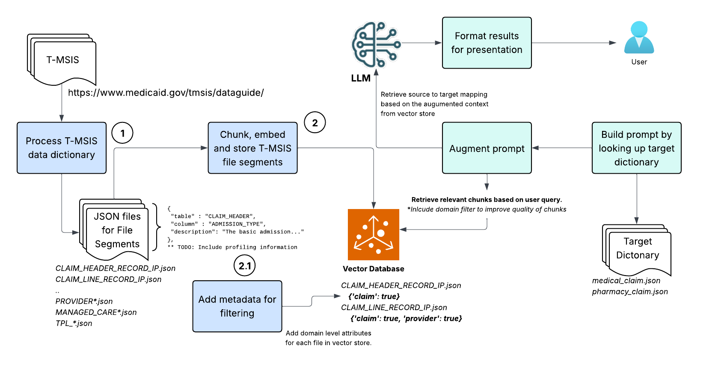

# 🔍 Automating Medicaid's T-MSIS Source-to-Target Mapping with OpenAI's Response API and File Search Tool

## Summary
This article guides you through automating source-to-target data mappings for Medicaid's Transformed Medicaid Statistical Information System (T-MSIS) by leveraging OpenAI's new Response API and File Search tool within a Retrieval-Augmented Generation (RAG) framework. It includes detailed steps for data preparation, vector store creation and management, and effective query construction.

---
## 📌 High Level architecture



---

## ⚙️ Part 1: Prepare T-MSIS Data dictionary

T-MSIS is a standardized data submission format used by Medicaid to streamline and ensure consistency across state-submitted data.  It defines file segments and data elements that covers comprehensive information about enrollment, claims, providers, and more. 

The data guide for the latest version of T-MSIS is available [here](https://www.medicaid.gov/tmsis/dataguide/file-segment-layouts/).  Generally, the data vendor will provide a data dictionary for source data. Alternatively, scrape the T-MSIS Data Dictionary from the Medicaid website using BeautifulSoup or similar tools.

Convert the data dictionary into a structured format (like JSONL) for each file segments stored in a separate JSON file. Each record in JSON file should contain the following fields:

- `table`: Name of the table for the file segment (e.g. `CLAIM_HEADER_RECORD_IP`)
- `column`: Name of the data element of the file segment  (e.g. `SUBMITTING_STATE`)
- `description`: Description of the data element (e.g. `A code that uniquely identifies the U.S. State or Territory..`)


Example JSONL file for the file segment : [**CLAIM_HEADER_RECORD_IP**](https://www.medicaid.gov/tmsis/dataguide/file-segment-layouts/cip-claim-inpatient/claim-header-record-ip/)
```json
{"table": "CLAIM_HEADER_RECORD_IP", "column": "RECORD_ID", "description": "The Record ID represents the type of segment being reported."}
{"table": "CLAIM_HEADER_RECORD_IP", "column": "SUBMITTING_STATE", "description": "A code that uniquely identifies the U.S. State or Territory.."}
...
{"table": "CLAIM_HEADER_RECORD_IP", "column": "ADMISSION_TYPE", "description": "The basic type of admission ..."}
{"table": "CLAIM_HEADER_RECORD_IP", "column": "DRG_DESCRIPTION", "description": "Description of the associated state-specific DRG code"}
{"table": "CLAIM_HEADER_RECORD_IP", "column": "CLAIM_TYPE", "description": "The type of claim being submitted"}
...
```

> Note: The organization of data with each file is important for retrieval augmented generation (RAG) architecture. First the structure itself should help LLM in building the formatted response for the data mapping query. Second, the contextually similar data should be clustered so the semantic representation is clearly representation in form a vector - More on this in final section of this article.


---

## 🧾 Part 2 : Create and Manage the Vector Store 

The prepared JSON files are now ready for ingestion into OpenAI’s vector store. You can either reuse an existing store or create a new one. These files will be uploaded to the vector store, which will then generate and store embeddings for each data element—enabling efficient similarity search during retrieval.

> Note: What role does **vector store** play in RAG - and fundamentally, what is RAG? For a concise overview, we recommend this article: [**Retrieval Augmented Generation (RAG) and Semantic Search for GPTs**](https://help.openai.com/en/articles/8868588-retrieval-augmented-generation-rag-and-semantic-search-for-gpts)


Create a new vector store or reuse an existing one using the OpenAI API. The following code snippet demonstrates how to create/get a vector store.

```python
from openai import OpenAI
import os

def create_or_get_vector_store(name: str, client: OpenAI = None):
    """
    Creates or retrieves a vector store with the given name using OpenAI's API.
    """
    client = client or OpenAI(api_key=os.getenv("MEDICAID_OPENAI_API_KEY"))
    if not client.api_key:
        raise ValueError("Set env var: MEDICAID_OPENAI_API_KEY")

    for vs in client.vector_stores.list():
        if vs.name == name:
            print(f"Vector store `{name}` (id={vs.id}) already exists.")
            return vs

    vector_store = client.vector_stores.create(name=name)
    print(f"Created vector store: `{name}` (id={vector_store.id})")
    return vector_store
```


> Open AI's API is well documented and easy to use. You can find the API documentation [here](https://platform.openai.com/docs/api-reference/introduction).  In above example, the API key should be first generated on Open AI's platform and stored in the environment variable `MEDICAID_OPENAI_API_KEY`.


Upload all the JSON files to the vector using using `file_batches.upload_and_poll` method. This method will load the files in batches and poll the status of the upload. The files will be processed in parallel, and the embeddings will be generated for each data element. 

```python
def upload_json_files_to_vector_store(vector_store_name, json_dir):
    file_paths = [os.path.join(json_dir, f) for f in os.listdir(json_dir)]
    vector_store = create_or_get_vector_store(vector_store_name, client)
    files = [open(path, "rb") for path in file_paths]

    client = get_openai_client()
    client.vector_stores.file_batches.upload_and_poll(
      vector_store_id=vector_store.id, files=files
    )
```    


> 	Note: The default chunking strategy for `file_search` uses a chunk size of 800 tokens with a 400-token overlap. You can override this behavior by specifying a custom chunking_strategy. [Learn more](https://platform.openai.com/docs/assistants/tools/file-search#customizing-file-search-settings).


To improve the performance of augmented context, we can add attribution to each file uploaded to the vector store. This can be used to filter the files based on the domain. For example, if you are interested in the `Claims` domain, you can add a `domain` field to each file uploaded to the vector store. This will help in filtering the files based on the domain when querying the vector store.

```python

def assign_attributes(vector_store_store, file, domain_names, client=None):
    client.vector_stores.files.update(
        vector_store_id=vector_store.id,
        file_id=file.id,
        attributes={domain: 'true' for domain_name in domain_names}
    )
```

---

## 🔍 Part 3: Query the vector store with LLM and retrieve mappings

The RAG system employs the effective prompt strategy to retrieve accurate mappings between source (T-MSIS) and target data dictionary. Here is the high level workflow.


### Retrieve target domain to build basic prompt
Based on user input, retrieve details from target dictionary and construct the query prompt that aligns with the structure saved in the vector store. The prompt should include the target table name, column name, and description. This will help the LLM understand the context of the query and generate accurate mappings.

For example, user inputs the target standard table `medical_claims` and wants to find the mapping for the column `patient_first_name`.  The method `build_map_prompt(..)` will first lookup the target dictionary to get the business description for the target column, and then build the prompt as : 

```
Find top 3 most relevant source data element that maps to the target table / column / description shown below. Print each matched data element in JSON format with the following fields: table, column, description.

{
  "table": "medical_claims",
  "column": "patient_first_name",
  "description": "The first name of the patient."
}
```  

> Note: This basic prompt can be improved considerably by adding more contextual information covered in the final section.

### Retrieve Relevant Data Elements
Use OpenAI's file search tool to retrieve relevant data elements from the vector store. The search will be based on the target table name, column name, and description. The search results will include the most relevant data elements from the T-MSIS data dictionary.


```python
def map_tmsis_to_target(target_table, target_column):
  vector_store = create_or_get_vector_store("tmsis_vector_store")
  response = client.responses.create(
      model="gpt-4o-mini-2024-07-18",
      input=build_map_prompt(target_table, target_column),
      tools=[{
          "type": "file_search",
          "vector_store_ids": [vector_store.id],
      }]
  )
  return format_response(response)
```

In above example, every T-MSIS file layout stored in the T-MSIS is searched for the relevant data elements. The search can be limited to specific domains by using the `domain` field added to the file when uploading to the vector store. For example, if you want to search only the claims domain, you can add a filter to the file search tool as shown below:
```python
     ...
      tools=[{
          "type": "file_search",
          "vector_store_ids": [vector_store.id],
          "filters": {
              "type": "eq",
              "key" : "claims",
              "value": "true"
          }
      }]
```


### Generate Mappings
The LLM will generate the mappings based on the retrieved data elements. The output will be in JSON format, which can be easily parsed and used for further processing.

```python
import re 

def format_response(response):
    results = []
    answer = response.output[-1].content[0].text.strip()
    # output will be surround by ```json and ``` so we need to remove it
    match = re.search(r"```json\s+(.*?)\s+```", answer, re.DOTALL)
    if match:
        json_str = match.group(1)
        mapped_columns = json.loads(json_str)
        option = 0
        for mapped_column in mapped_columns:
            option += 1
            source_to_target_map = D.Source2TargetMap(
                source_table=mapped_column['table'],
                source_column=mapped_column['column'],
                source_description=mapped_column['description'],
                option=option,
                target_table=target_table,
                target_column=target_column,
                target_description=target_description
            )
            results.append(source_to_target_map)

    return results
```


---

## 🚀 Conclusion and Next Steps

This solution streamlines the generation of accurate source-to-target mappings, significantly reducing manual efforts and errors. Potential enhancements include:


* Enrich the prompt with additional contextual information. Few examples of this could be:
  * Describe the nature of data element, like data type or range of values.
  * Include most common values for the target columns. 

* Organize the data elements so the elements relevant for each subject are co-located in the file. This can ensure that the similar data elements are in same chunk and as a result, the word embedding will reflect a stronger *semantic* representation of the subject.  

* Integrating user feedback loops to refine query results. An example of this could be another vector store that captures the validated source to target mapping for the same target from other sources. This can be used as a further contextual information for the LLM to generate the mapping.

* If the target model is standardized and there is a large inventory of existing data mappings, it can be used to fine-tune the LLM model. The fine-tuned model will have a deeper understand of the target model and with a vector store of the source data, it can be used to generate the source to target mapping with a higher accuracy.


We welcome your feedback and suggestions for future topics!

---

## 🤝 Partner With Us

Looking to build similar RAG-based automation or other intelligent data engineering solutions for your organization?

[**Beesbridge**](https://beesbridge.us/) specializes in modernizing data platforms, automating pipelines, and leveraging cutting-edge AI to streamline operations.

[Contact us](mailto:admin@beesbridge.us) to explore how we can help you unlock the full potential of your data.

---

## 📚 References

- [T-MSIS Data Overview](https://www.medicaid.gov/tmsis/dataguide/)
- [Retrieval Augmented Generation and Semantic Search for GPTs](https://help.openai.com/en/articles/8868588-retrieval-augmented-generation-rag-and-semantic-search-for-gpts)
- [OpenAI File Search Tool Docs](https://platform.openai.com/docs/guides/file-search)
 - [Customizing File Search Settings](https://platform.openai.com/docs/assistants/tools/file-search/customizing-file-search-settings)

