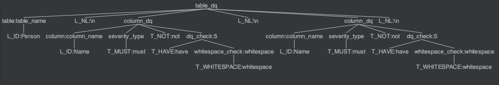

# Increased Data Usability for Healthcare through Automated Data Quality on Databricks

by  [Navdeep Alam](https://www.linkedin.com/in/navdeepalam/), [Mohit Sauhta](https://www.linkedin.com/in/mohitsauhta)

```
This is collaborative work from Abacus Insights and Beesbridge, the delivery partner for Databricks.
```

Faced with clinician shortages, an aging population, and stagnant health outcomes, the healthcare industry has the potential to greatly benefit from disruptive technologies such as artificial intelligence.  However, high quality and usable data are the lifeblood of any advanced analytics or machine learning system, and in the highly complex healthcare industry, data quality (DQ) has historically been poor, with limited standards and inconsistent implementations.   With the potential to impact a patient’s care and health outcomes, making sure healthcare data is of high quality and usable couldn’t have higher stakes.  As a result, healthcare companies need to ensure their foundational data is truly usable – defined as accurate, complete, timely, relevant, versatile and use case and application agnostic – before using it to train advanced machine learning models and unlock the promise of artificial intelligence.  

Abacus Insights, as a healthcare technology leader with the only data transformation platform and solutions built specifically for health plans, has a core competency and value proposition of integrating data silos and delivering usable data. To solve the data quality challenge, we introduced the concept of  [**Data Grading**](#data-grading) where the data is augmented with a data quality score, ensuring that downstream consumers of the data understand its degree of usability. The natural corollary of that score is to have [**Process Transparency**](#process-transparency) that allows our customers to interpret the results. This blog post will walk you through the high-level details of how we have implemented these concepts using Spark, and Delta Lake on the Databricks platform.

## Process Transparency
Data grading is the outcome of data quality rules that can be applied on the raw data from the source system in `Bronze` layer, as well as the data which is transformed and enriched in `Silver` layer. The section first explores the construction of a data quality rule engine that enables the end-user in the business to interpret the DQ rule and thereby promotes the process transparency. The section then explores how this engine is implemented using Spark and Delta Lake on the Databricks platform.

In addition, the data quality is continuously improved in Databricks' medallion architecture as the data is **curated** with help of the data quality rule engine , and then published as **trusted** asset to drive the downstream analytics and machine learning use cases.  The following diagram shows the high level flow of data quality in the medallion architecture.


### Data Quality Rule Engine
The first question that comes to mind is why a grammar is needed to represent data quality rule?  One can also build such rules in most of the popular data quality tools/libraries - after all, these tools provide rich visual interface and useful report outputs. However, these tools are not designed to work natively on the Databricks platform that support co-mingled workload made up of Batch and Streaming pipelines.  In addition, these tools are not custom-built for delta lakehouse use cases. On one hand, the grammar enables the DataOps engineer to express the data quality rules in a simple and intuitive manner that can be interpreted by a non-technical user. On the other hand, it also allows the generation of efficient Spark code that can be run natively using Dataframe API along with the data engineering pipelines.

#### Harnessing the power of ANTLR on Databricks Platform
Databricks' platform is built on open standards like Spark and Delta that can be extended easily to support specialized use cases by using other custom libraries, framework, or methodologies. One of the more popular examples is how Databricks were able to bring the power of large language model (LLM) to the platform by releasing [Dolly 2.0](https://www.databricks.com/blog/2023/04/12/dolly-first-open-commercially-viable-instruction-tuned-llm).  Similarly, we have integrated a powerful parse generator, [ANTLR](https://www.antlr.org/) with Spark and Delta Lake to build and deploy an English-like grammar for a data quality rule engine.  In particular, the distributed compute and open framework of Spark enables the execution of the following end to end flow in a scalable manner.


### Implementation Details

The implementation of Data Quality Rule engine is constructed using the following components:
1. [DQ Grammar](#dq-grammar) : Builds the domain specific language for data quality rules.
2. [DQ Rules](#dq-rules)  : Defines the data quality validation checks.
3. [DQ Parser](#dq-parser) : Parse the data quality rules to generate Rule Abstract Syntax Tree (AST), and calls ParserVisitor for each node in the AST.
4. [DQ Visitor](#dq-visitor) : Constructs the Spark code incrementally for each node in the AST.


#### DQ Grammar
Data Quality grammar is expressed using [ANTLR](https://www.antlr.org/) grammar. ANTLR is a powerful parser generator for reading, processing, executing, or translating structured text or binary files. It is widely used to build languages, tools, and frameworks. The grammar itself is made up of two parts: **Lexer** and **Parser** rules.

##### Lexer Grammar
Used to define the tokens that are used to build the grammar. Here is the snippet of the tokens and literals used in the grammar.

`DataQualityLexer.g4`
```antlr
lexer grammar DataQualityLexer;

// Lexer rules
T_MUST : M U S T;
T_SHOULD : S H O U L D;
//...
T_CONTAINS : C O N T A I N S;
T_NOW : N O W;
T_CONSECUTIVE : C O N S E C U T I V E;
T_HUMAN_NAME : H U M A N '_' N A M E;

// Functions
T_LENGTH : L E N G T H;
T_COUNT : C O U N T;
//...

// Literals
L_GT : '>';

L_ID : [a-zA-Z_][a-zA-Z0-9_]*; //Identifier

// case insensitive keywords
fragment A : ('a' | 'A');
fragment B : ('b' | 'B');
//...
fragment Z : ('z' | 'Z');
```

**Parser Grammar** : Used to define the grammar rules. Here is the snippet of the rules used in the grammar.

`DataQualityParser.g4`

```antlr
parser grammar DataQualityParser;

table_dq :
    L_NL* table L_NL+ (column_dq L_NL+)* column_dq L_NL*
    ;
table:
    L_ID          # table_name
    ;

column_dq :
    column severity_type T_NOT? dq_check
    ;

severity_type:
    T_MUST | T_SHOULD
    ;
//...

// dq checks
dq_check:
     T_BE T_IN lookup_check
    | T_BE T_IN set_check
    | T_BE value_compare
    | T_MATCH  pattern_check
    | T_HAVE whitespace_check
    | T_BE null_check
    | T_BE human_check
    | T_BE past_check
    ;

//..
```

#### DQ Rules
Data Quality rules are defined based on the grammar defined above. The rules are grouped together for each entity, and each rule validates an attribute of that entity. 

To make the rules as succinct as possible, and yet intuitive for the business user to understand the intent of the rule, we use the following keywords in the rules:
* `must` and `should` indicate the **mandatory** and **recommended** quality requirements.
* `be`, `not`, `less than`, `greater than` and `have` specify the nature of comparison in the action
* `human_name`, `white space` indicate the special quality checks that are not supported by the standard comparison operators.

In this example, the rules are defined for the `Person` entity and validates attributes `Name`, `BirthDate`, and `Designation`.  

`Person.dq`
```
Person
    Name should be human_name
    Name must not have whitespace
    
    BirthDate must be valid date
    BirthDate should be less than now

    EffDate must be greater than BirthDate
    Designation must be in ['Doctor', 'Nurse', 'Pharmacist', 'Technician']
```

#### DQ Parser
Parser is the component that parses the data quality rules and generates the Rule Abstract Syntax Tree (AST).  As an example, the AST for two DQ rules will be represented as shown below.




Building the lexer/parser code ground up can be cumbersome, but `ANTLR`  makes short work of that by generating the `Lexer`, `Parser` as well as the base `Visitor` (or `Listener`)  classes in multiple target language.  

```shell
antlr4 -Dlanguage=Python3                     \
  -no-listener -visitor                       \
  src/data_quality/antlr/DataQualityLexer.g4  \
  src/data_quality/antlr/DataQualityParser.g4
```
*Command to generate the lexer, parser, and visitor base code in Python*


#### DQ Visitor
After the DQ Rule is parsed into the AST,  DQ Visitor traverses the tree and incrementally adds custom behavior for each node in the tree.  

The following snippet shows how the user input `dq_rules` are converted to an AST `tree` which is then used by `DataQualityCustomVisitor` to perform data quality validation against the input `df: DataFrame` using the same `spark: SparkSession` that is used to create the dataframe.

```
```
```python
from antlr4 import *
from data_quality.antlr.DataQualityLexer import DataQualityLexer
from data_quality.antlr.DataQualityParser import DataQualityParser
from pyspark.sql import DataFrame, SparkSession, functions as F
# ..
# ..
def apply_dq_rules(dq_rules: str, df: DataFrame, spark: SparkSession = None) -> DataFrame:
    input_stream = InputStream(dq_rules)
    lexer = DataQualityLexer(input_stream)
    stream = CommonTokenStream(lexer)
    parser = DataQualityParser(stream)
    tree = parser.table_dq()
    if parser.getNumberOfSyntaxErrors() != 0:
        print("Syntax error")
        print(tree.toStringTree(recog=parser))
        return

    visitor = DataQualityCustomVisitor(df=df, spark=spark)
    df_with_rules = visitor.visit(tree)
    return df_with_rules

```


The line `visitor.visit(tree)` in above code starts a tree traversal that will invoke the visit implementation of each node of the tree.

Each row of DQ rule corresponds to the following visit function call.

```python
def visitColumn_dq(self, ctx: DataQualityParser.Column_dqContext):  
	# Start a new DQ Builder
    self.currentDqBuilder = DqBuilder(self.df)  
    # Get the column being checked
    self.currentDqBuilder.source_column = self.visit(ctx.column())  
    # MUST - severe, SHOULD - warning
    self.visitSeverity_type(ctx.severity_type())  
    # continue traversal to children
    self.visitChildren(ctx.dq_check())  
    if ctx.T_NOT():  
        self.currentDqBuilder.dq_type = "not_" + self.currentDqBuilder.dq_type  
        self.currentDqBuilder.dq_spark_col = ~self.currentDqBuilder.dq_spark_col  
	
	# traversal is completed - construct the DQ column
    col_name = self.currentDqBuilder.get_dq_col_name()  
    spark_col = self.currentDqBuilder.get_dq_spark_col()  
    if col_name in self.dq_cols_map:  
        raise ValueError(f"{col_name} is already taken")  
    self.dq_cols_map[col_name] = spark_col  
    self.currentDqBuilder = None
```


The `ctx.dq_check()` will invoke a visit to appropriate DQ check node. For instance the check `BirthDate should be less than now`  will  be handled by the following piece fo code will construct a new DQ column on the spark dataframe with the condition `col < F.current_timestamp()`.  

```python
def visitPast_check(self, ctx: DataQualityParser.Past_checkContext):  
    col = self.currentDqBuilder.source_column  
    self.currentDqBuilder.dq_type = "lt_now"  
    self.currentDqBuilder.dq_spark_col = col < F.current_timestamp()
```

Another DQ Rule from above:  `Name should be human_name`  will invoke the following DQ check `visit` method, that adds a new DF column with a regular expression check.

```python
def visitHuman_check(self, ctx: DataQualityParser.Human_checkContext):  
    col = self.currentDqBuilder.source_column  
    self.currentDqBuilder.dq_type = "human_name"  
    self.currentDqBuilder.dq_spark_col = col.rlike(r"^(?:[A-Za-z\-\']+\s?)*$")
```


#### Final thoughts on Data Quality Grammar
**Process Transparency** - The Data Quality grammar is a declarative language that is easy to understand and can be shared with the business users. The grammar is also easy to extend and can be used to define other quality checks.
**Optimized Execution** - The DQ rules are converted into optimized Spark code that is lazily evaluated on the same Dataframe that is generated from preceding data transformation steps. Traditional approach of data quality validation is to persist the ETL output and then perform data quality check.  Performing data quality checks inline can save this additional round trip to the persistent storage layer.


## Data Grading
*What is Data Grading?*
Data grading is the process of assigning a grade to each row of the dataframe based on the data quality check results.  In practice, the true data grade is dependent on the final analytical use case.  For instance, the data grade for a customer record can be based on the data quality of the customer name, address, and phone number.  On other hand, the data grade for a product record can be based on the data quality of the product name, description, and price.  Since the data grading subjective to the analytic use case,  it is important to retain the data quality results at the row level without filtering out any failed validations.

### Methodology to store the data quality results
In the first pass, each data quality check is performed for each row of the input dataframe.  The result of the data quality check is a new boolean column that is added to the dataframe.  The value of the new column is a boolean that indicates whether the data quality check passed or failed.  The data quality check can be either a `MUST` or `SHOULD` check.  The `MUST` check is a severe check and the `SHOULD` check is a warning check. The column name is constructed using the tested **severity type**, **column name**, and **data quality check type**.  For instance, the data quality check `Name should be human_name` will add a new column `dqw_Name_human_name` to the dataframe.  The value of the new column will be `True` if the data quality check passed and `False` if the data quality check failed. In a similar fashion, the data quality check `BirthDate must be less than now` will add a new column `dqs_BirthDate_lt_now` to the dataframe. The value of the new column will be `True` if the data quality check passed and `False` if the data quality check failed.

| Name       | BirthDate   | dqs_Name_human_name | dqw_BirthDate_lt_now |
| -----------| ----------- | ------------------ |--------------------- |
| John       | 1982-12-01  | True               | True                 |
| Mark       | 2042-01-01  | True               | False                |
| Gle9       | 2012-01-01  | False              | True                 |


The above format of storing data is not optimal for the following reasons:
1. The number of columns in the dataframe will increase linearly with the number of data quality checks.
2. The column names are not easy to read and understand.
3. Most of the checks will pass and the information ratio (about the failed tests) is very low.

Furthermore, the `Audit-Balance-Control` framework in most Data Quality Management (DQM) tools may require the total number of severe and warning failure counts. 

The following code snippet converts the above dataframe into a more compact format that is easy to read and understand.

```python
def flatten_dq_results(df_with_rules: DataFrame) -> DataFrame:
    # get all the columns for severe errors
    dqs_array_col = F.filter(F.array([
        F.when(F.col(c).eqNullSafe(F.lit(True)), F.lit(None)).otherwise(F.lit(c[4:]))
        for c in df_with_rules.columns if c.startswith('dqs_')
    ]), lambda x: x.isNotNull())
    # get all the columns for warning errors
    dqw_array_col = F.filter(F.array([
        F.when(F.col(c).eqNullSafe(F.lit(True)), F.lit(None)).otherwise(F.lit(c[4:]))
        for c in df_with_rules.columns if c.startswith('dqw_')
    ]), lambda x: x.isNotNull())
    dq_result = F.struct(
        F.size(dqs_array_col).alias('SevereCount'),
        F.size(dqw_array_col).alias('WarningCount'),
        dqs_array_col.alias("SevereErrors"),
        dqw_array_col.alias("WarningErrors")
    )
    df_with_rules = df_with_rules.withColumn('DataQualityResult', dq_result)
    df_clean = df_with_rules.drop(*[c for c in df_with_rules.columns if c.startswith('dqw_') or c.startswith('dqs_')])
    return df_clean
```

Once the data quality results are flattened as shown below, the data grade is showcased by the count of severe and warning occurances, indicating the degree of the issue, while also showcasing the specific data quality issue discovered. Abacus Data Platform uses these metrics and grades to  further apply a business context grade on the data, while enrichening the data from the `Silver` to `Gold` layer.

**Final table with grade and data quality results**

| Name       | BirthDate   | DataQualityResult |
| -----------| ----------- | ------------------ |
| John       | 1982-12-01  | { "SevereCount": 0,<br>"WarningCount":0,<br> SevereErrors: [],<br> WarningErrors:[]}               |
| Mark       | 2042-01-01  | { "SevereCount": 0,<br>"WarningCount":1,<br> SevereErrors: [],<br> WarningErrors:["BirthDate_lt_now"]}                |
| Gle9       | 2012-01-01  | { "SevereCount": 1,<br>"WarningCount":0,<br> SevereErrors: ["Name_human_name"],<br> WarningErrors:[]}               |

Abacus Insights manages healthcare data by breaking down data silos to make a real impact for our customers and their members. Our platform standardizes data across the healthcare ecosystem by providing a highly secure unified data platform that minimizes change management and maximizes analytics enablement to reduce costs and improve outcomes. We provide a data platform that enables our customers to build a data-driven culture and drive better outcomes.

Beesbridge is Databricks' delivery partner specializing in building scalable and high-performance data infrastructure.  We have built a team of solution architects and data engineers, who have helped many organizations unlock the potential of their data on Databricks platform by building innovative solutions.